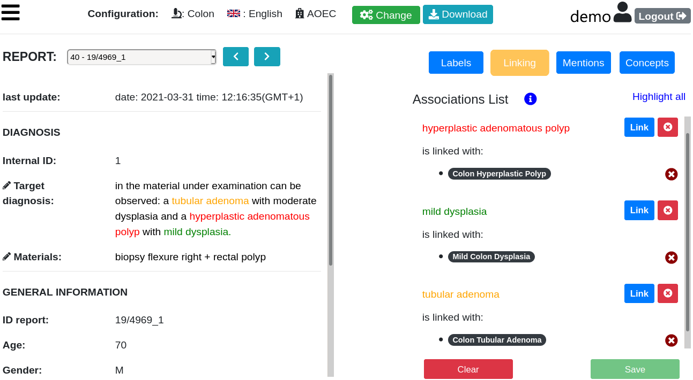

# ExaTag

This repository contains the source code of ExaTag, a biomedical annotation tool for tagging biomedical concepts in clinical reports.
ExaTag is publicly available at [w3id.org/exatag](http://w3id.org/exatag).

The ExaTag front-end is contained inside the **frontend** folder. The ExaTag front-end has been developed in [ReactJS](https://reactjs.org/).

The ExaTag back-end is contained inside the **backend** folder. The ExaTag back-end has been developed in [Django](https://www.djangoproject.com/).

